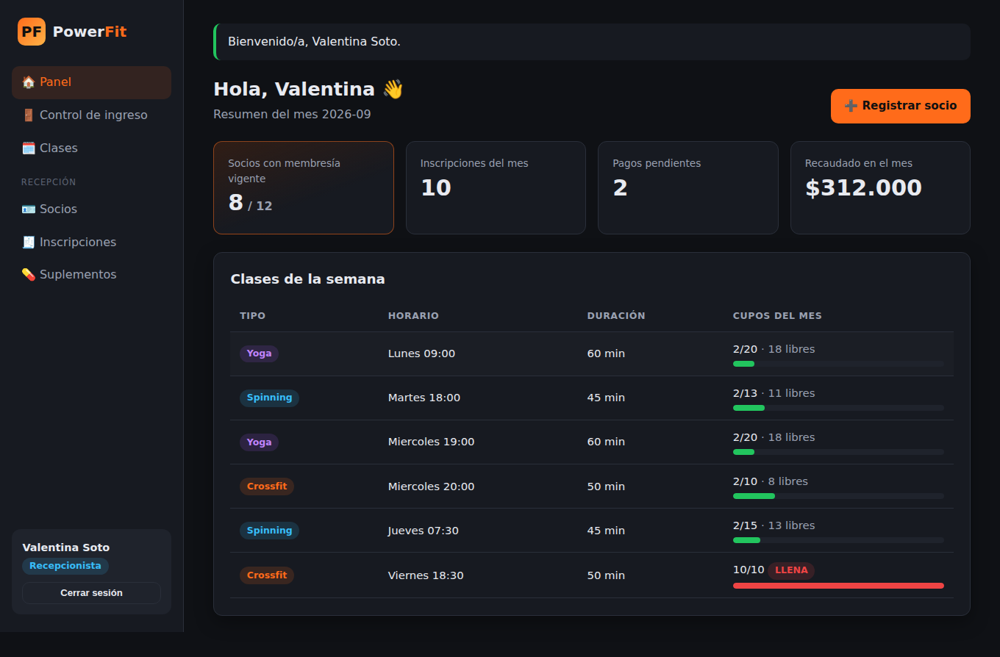

# 🏋️ PowerFit — Sistema de gestión de gimnasio

Prototipo funcional para la asignatura **Programación Orientada a Objeto Seguro** (TI3V21 · 114-2B-F1).

**Integrantes:** Javier Ojeda · Javier Concha
**Arquitectura base:** repositorio del profesor [`michaelarjelm/Taller-Mecanico`](https://github.com/michaelarjelm/Taller-Mecanico) (model / dao / conectar.py / main.py)



---

## ¿Qué hace?

| # | Requerimiento del negocio | Cómo se resolvió |
|---|---|---|
| 1 | Yoga, Spinning y Crossfit con distinto cupo y duración; los cupos disponibles se calculan distinto según el tipo | `Clase` abstracta con `cupos_disponibles()` **abstracto**; cada subclase lo sobrescribe (polimorfismo) |
| 2 | Instructor dicta clases y marca asistencia; recepcionista inscribe y cobra, pero **no** crea ni modifica clases | `Trabajador` abstracta → `Instructor` / `Recepcionista`. La recepcionista no tiene `crear_clase()` y la web le responde **403** |
| 3 | Validar el RUT antes de crear la ficha | Algoritmo **módulo 11**; el constructor de `Socio` lanza `ValueError` si es inválido |
| 4 | Varias clases bajo una misma inscripción mensual con su detalle | `InscripcionMensual` ◆── `DetalleClaseReservada` (composición 1..*) |
| 5 | No inscribir en clase llena ni dejar entrar con membresía vencida | `CupoLlenoException` y `MembresiaVencidaException` (excepciones propias) |
| 6 | Suplementos importados cotizados con el dólar del día | `Suplemento.actualizar_precio(valor_dolar)` + API pública **mindicador.cl** con caché y respaldo |

## Cómo ejecutarlo (local)

```bash
# 1. Clonar e ingresar
git clone https://github.com/javijavierojeda-hash/gym-powerfit.git
cd gym-powerfit

# 2. Crear entorno virtual e instalar dependencias
python -m venv .venv
# Windows:  .venv\Scripts\activate     |  Mac/Linux:  source .venv/bin/activate
pip install -r requirements.txt

# 3. Levantar la aplicación web (crea powerfit.db con datos de ejemplo)
python app.py
# Abrir http://localhost:5000
```

| Usuario de demostración | RUT | Contraseña |
|---|---|---|
| Instructora (Camila Rojas) | `11.111.111-1` | `Instructor123!` |
| Recepcionista (Valentina Soto) | `22.222.222-2` | `Recepcion123!` |

Otros comandos:

```bash
python main.py          # Demo por consola de los 6 requerimientos (estilo del profe)
python seed.py          # Carga datos de ejemplo (no duplica si ya existen)
python -m pytest        # Ejecuta las 70 pruebas automáticas
```

Para empezar de cero, borra `powerfit.db` y vuelve a ejecutar `python app.py`.

## Estructura del proyecto

```
gym-powerfit/
├── model/            # Clases del dominio (lo que ES el negocio) — 11 clases + 2 excepciones del UML
├── dao/              # Acceso a datos (patrón DAO sobre SQLite), un DAO por tabla
├── services/         # Servicios externos: dólar del día (mindicador.cl)
├── web/              # Aplicación Flask: rutas, seguridad, plantillas HTML, CSS y JS
├── tests/            # 70 pruebas automáticas (pytest)
├── docs/             # Backlog, arquitectura, seguridad, despliegue y capturas
├── conectar.py       # Conexión a SQLite (igual que el profe)
├── main.py           # Demo por consola (igual que el profe)
├── seed.py           # Datos de ejemplo
└── app.py            # Punto de entrada de la web
```

## Documentación

- 🧱 [Arquitectura y base de datos](docs/ARQUITECTURA.md): capas, cómo se vinculan y el modelo de tablas.
- 🔐 [Seguridad](docs/SEGURIDAD.md): cada control y dónde está en el código.
- 🚀 [Despliegue](docs/DESPLIEGUE.md): servidor local y publicación en PythonAnywhere.
- 📋 [Backlog Jira](docs/BACKLOG_JIRA.md): épicas, historias y sprints.
- 🤖 [Prompts maestros](PROMPTS_MAESTROS.md): secuencia para recrear o extender el proyecto con IA.

---

## Bitácora de Avances

### 25 de Septiembre de 2026
- **Planificación:** análisis del informe UML, del diagrama `.drawio` y del repo del profesor. Backlog completo para Jira en `docs/BACKLOG_JIRA.md` (6 épicas, 22 historias, 2 sprints).
- **Estructura base:** paquetes `model`, `dao`, `services`, `web` y `tests`; `.gitignore` (excluye `*.db`, `.env`, `.venv`) y `requirements.txt` con versiones fijas.
- **Modelo de dominio (`model/`):**
  - Herencia: `Trabajador` (ABC) → `Instructor`, `Recepcionista`; `Clase` (ABC) → `Yoga`, `Spinning`, `Crossfit`.
  - Polimorfismo: `cupos_disponibles()` distinto en cada tipo de clase.
  - Composición: `Socio` ◆ `Membresia`; `InscripcionMensual` ◆ `DetalleClaseReservada`.
  - Excepciones propias: `CupoLlenoException` y `MembresiaVencidaException`.
  - Encapsulamiento con atributos privados, `@property` y setters con validación.
  - Contraseñas con PBKDF2-SHA256 + salt y comparación en tiempo constante.
- **Integración con SQLite (`conectar.py` + `dao/`):**
  - `Dao` base con conexión, cursor y manejador de transacciones (`BEGIN IMMEDIATE` / commit / rollback).
  - Herencia relacional tabla por tipo (como `VehiculoDao` → `AutoDao`): `TrabajadorDao` → `InstructorDao`/`RecepcionistaDao` y `ClaseDao` → `YogaDao`/`SpinningDao`/`CrossfitDao`.
  - 15 tablas con llaves foráneas, `UNIQUE`, `CHECK` y `ON DELETE CASCADE`.
  - El cupo se verifica contra la BD dentro de la transacción (no se puede sobrevender).
- **Servicio del dólar:** API mindicador.cl con timeout, validación, caché de 1 hora y valor de respaldo.
- **Script principal (`main.py`) y datos demo (`seed.py`).**
- **Aplicación web Flask:** login por rol, socios, inscripciones con total en vivo, cobros, control de ingreso, clases, asistencia y suplementos. CSRF, cabeceras de seguridad, bloqueo por fuerza bruta y 403 por rol.
- **Pruebas:** 70 pruebas con pytest (modelo, DAO y web).
- **Documentación:** código comentado línea por línea y documentos en `docs/`.
