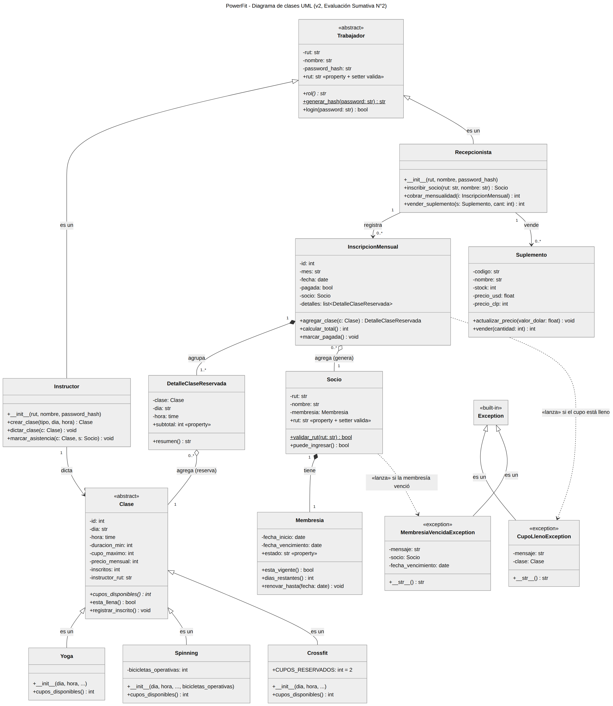

# 🏋️ PowerFit — Sistema de gestión de gimnasio

Programación Orientada a Objeto Seguro · TI3V21 · Sección 114-2B-F1 · Docente: Michael Arjel · **Evaluación Sumativa N°3**

## 1. Integrantes y negocio

| | |
|---|---|
| **Integrantes** | Javier Ojeda · Javier Concha |
| **Negocio asignado** | **Gimnasio PowerFit**: clases de Yoga, Spinning y Crossfit; socios con membresía mensual; venta de suplementos importados |
| **Requisitos de la ficha** | ① Tres subtipos con un método distinto: `Yoga`, `Spinning` y `Crossfit` → `cupos_disponibles()` · ② Dato con validación: RUT del socio (módulo 11, en el setter) · ③ Transacción con detalle: `InscripcionMensual` → `DetalleClaseReservada` · ④ Dos reglas: no inscribir en una clase con el cupo lleno y no dejar entrar a un socio con la membresía vencida · ⑤ Precio con indicador externo: suplementos según el **dólar del día** (API mindicador.cl) |

## 2. Cómo instalar y ejecutar el programa

Se necesita solo **Python 3.10 o superior** e internet para instalar las librerías (la primera vez). Se puede descargar desde [python.org](https://www.python.org/downloads/) marcando **"Add Python to PATH"** al instalar.

```bash
# 1. Descargar el proyecto
git clone https://github.com/javijavierojeda-hash/gym-powerfit.git
cd gym-powerfit
#    (sin git: botón verde "Code" -> "Download ZIP", descomprimir y abrir una terminal en la carpeta)

# 2. Instalar las librerías (requests, Flask y pytest)
python -m pip install -r requirements.txt
#    En Mac/Linux puede ser "python3" en vez de "python". En Windows también sirve "py".

# 3. Ejecutar el programa
python main.py
```

La primera vez el programa **crea solo la base de datos** (`powerfit.db`, SQLite) con todas sus tablas y datos de ejemplo: trabajadores, 6 clases, 12 socios y 4 suplementos. Para empezar de cero, se borra `powerfit.db` y se ejecuta de nuevo.

**Inicio de sesión.** El programa pide RUT y contraseña. El RUT se puede escribir con o sin puntos.

| Usuario | RUT | Contraseña | Qué puede hacer |
|---|---|---|---|
| Recepcionista (Valentina Soto) | `22222222-2` | `Recepcion123!` | Socios, inscripciones, cobros, control de ingreso y suplementos |
| Instructora (Camila Rojas) | `11111111-1` | `Instructor123!` | Crear, modificar y eliminar clases; registrar asistencia |

Cada rol ve solo sus opciones. Con la opción **C** se cambia de usuario sin cerrar el programa, y en cualquier dato se puede escribir **0** para cancelar y volver al menú.

### Guía rápida para el guion de pruebas

| Prueba | Usuario | Qué hacer en el menú |
|---|---|---|
| P01 | — | `python main.py` → iniciar sesión → aparece el menú |
| P02 a P06 | Recepcionista | **1** Registrar socio · **2** Listar · **3** Modificar (correo o teléfono) · salir con **0**, volver a abrir y **2** · **4** Eliminar |
| P07 y P08 | Recepcionista | **1** Registrar socio con `12.345.678-5` (se acepta) o `12.345.678-9` (se rechaza con un mensaje) |
| P09 a P11 | **Instructora** (opción **C**) | **2** Crear clase de Yoga, Spinning o Crossfit → muestra su cupo máximo, su duración y los cupos disponibles · **1** Ver clases y cupos |
| P12 y P13 | Recepcionista | **7** Registrar inscripción mensual: por ejemplo, N° `1,6` = Yoga lunes + Crossfit miércoles · **8** Ver detalle |
| P14 | Recepcionista | **7** Inscribir en la clase N° 3 (Crossfit viernes 18:30, que ya está **llena**) a un socio sin inscripción, por ejemplo `24681357-4` |
| P15 | Recepcionista | **1** Registrar socio → membresía "Ingresar fecha de vencimiento" con una fecha pasada → **11** Control de ingreso |
| P16 y P17 | Recepcionista | **12** Suplementos: muestra el dólar usado y la fuente. Sin internet, avisa el motivo y usa el último valor guardado |
| P18 | Cualquiera | Escribir `99` en el menú |
| P19 | Cualquiera | Escribir `abc` en el monto de **9** Cobrar mensualidad o en las bicicletas (cupo) al crear un Spinning |

**Otros comandos:**

```bash
python -m pytest     # 101 pruebas automáticas (incluye el guion P01-P19 en tests/test_consola.py)
python app.py        # Opcional: la misma aplicación en versión web, en http://localhost:5000
python demo_modelo.py  # Demostración del modelo de la Evaluación Sumativa N°2
```

## 3. Decisiones de seguridad

### 3.1 Cómo se evita la inyección SQL
- **Todas las consultas son parametrizadas**, con el marcador `?` de `sqlite3`. El texto que escribe el usuario viaja como un dato aparte y nunca se pega dentro del SQL:
  ```python
  # dao/socio_dao.py
  self.cursor.execute("UPDATE socios SET nombre = ?, correo = ?, telefono = ? WHERE rut = ?",
                      (socio.nombre, socio.correo, socio.telefono, socio.rut))
  ```
- Los únicos SQL armados con `f-string` usan **nombres de tablas o columnas fijos del código**, como `TABLA_HIJA` o la lista `("correo", "telefono")` de la migración, nunca texto del usuario.
- **No hay SQL dentro de `model/`.** Todo el acceso a la base de datos está en `dao/`, con un DAO por entidad.
- **Integridad:**
  - las llaves foráneas están activas (`PRAGMA foreign_keys = ON`) con `ON DELETE CASCADE`;
  - el RUT es la llave primaria, así que no puede repetirse;
  - la inscripción y sus líneas de detalle se guardan en **una sola transacción** (`BEGIN IMMEDIATE`), con `rollback` si algo falla;
  - el cupo se vuelve a revisar dentro de esa misma transacción, para que no se venda dos veces.

### 3.2 Qué entradas se validan
Toda entrada se valida **antes de usarse** en `consola/entradas.py` y en los setters del modelo. Si un dato no sirve, se muestra el motivo y se vuelve a preguntar; el programa nunca se cae.

| Entrada | Validación (tipo, formato y rango) | Dónde |
|---|---|---|
| **RUT del socio** (dato de la ficha) | Formato y **dígito verificador módulo 11**, al crear y al cambiar | `@rut.setter` en `model/socio.py` |
| Nombre | Obligatorio, máximo 80 caracteres | `@nombre.setter` |
| Correo | Opcional; `nombre@dominio.cl`, máximo 100 caracteres | `@correo.setter` |
| Teléfono | Opcional; celular chileno de 9 dígitos (acepta `+56` y espacios) | `@telefono.setter` |
| Opción del menú | Solo las opciones listadas; `99` → "no existe" | `main.menu()` |
| Números: monto, bicicletas, cantidad, N° | Solo dígitos y **rango**: monto ≥ total, bicicletas de 1 a 15, cantidad de 1 al stock | `pedir_entero()` |
| Fechas y horas | `DD-MM-AAAA` real (rechaza 31-02); hora `HH:MM` entre 06:00 y 22:00 | `pedir_fecha()`, `pedir_hora()` |
| Días, tipos de clase y meses | Se eligen de una lista cerrada | `pedir_opcion()` |
| Lista de clases (`1,6`) | Solo N° existentes y sin repetir | `registrar_inscripcion()` |
| Respuesta de la API | Debe ser un número entre 100 y 5000; si no, se descarta | `DolarService._interpretar()` |

### 3.3 Autenticación y permisos
- Las contraseñas se guardan con **hash PBKDF2-SHA256** (260.000 iteraciones y un salt distinto por usuario). Se comparan con `hmac.compare_digest`, que tarda lo mismo aunque falle (evita ataques por tiempo).
- Al escribirla, la contraseña **no se ve** (`getpass`).
- El mensaje de error es siempre el mismo ("RUT o contraseña incorrectos"), así no revela qué RUT existen. **Tras 5 intentos fallidos el programa se cierra.**
- **Permisos por rol:**
  - solo `Instructor` tiene el método `crear_clase()`, y cada instructor modifica o elimina únicamente sus propias clases;
  - la recepcionista no ve esas opciones.

### 3.4 Consumo seguro de la API
- La consulta está en **una sola clase**, `services/dolar_service.py`, y usa `requests.get(..., timeout=5)`.
- Cada falla se informa al usuario con su causa y el programa **sigue funcionando** con el último valor guardado:
  - sin conexión (`ConnectionError`);
  - demora (`Timeout`);
  - error HTTP (`raise_for_status`);
  - respuesta inesperada (JSON inválido, sin `serie` o con un valor que no es número).
- Las dependencias tienen la versión fijada. Se usa `requests` 2.32.5 porque desde la 2.32.4 corrige la vulnerabilidad CVE-2024-47081.

## 4. Uso de inteligencia artificial

Usamos **Claude (Anthropic), a través de Claude Code**, como asistente de programación. El equipo definió el negocio, el modelo UML y las reglas, y revisó cada propuesta comparándola con la pauta y ejecutando las pruebas. Estos son ejemplos concretos de esta evaluación:

| Lo que propuso la IA | Decisión | Razón técnica |
|---|---|---|
| Consultar la API con `urllib.request`, de la librería estándar, "para no instalar nada" | **Modificado** | La pauta pide la librería oficial `requests`. Además, `requests` separa los errores en `Timeout`, `ConnectionError` y `HTTPError`, lo que permite avisar la causa exacta. Se cambió a `requests.get(URL, timeout=5)` + `raise_for_status()`. |
| Capturar cualquier falla de la API con un solo `except Exception:` y usar el valor de respaldo en silencio | **Modificado** | Un `except` genérico esconde el motivo, y también errores de programación como un `NameError`. Se reemplazó por un `except` para cada tipo de falla, y cada uno guarda un aviso que el menú muestra ("no hay conexión…", "no respondió en 5 segundos…", "respuesta inesperada"). |
| Validar el RUT solo en el menú, antes de crear el socio | **Descartado** | La regla debe vivir en un solo lugar: el `@rut.setter` de `Socio`. El menú crea una ficha temporal y deja que el setter valide, así la misma regla protege la consola, la web y los DAO. |
| Leer los números con `int(input())` dentro de un `try` | **Modificado** | `int()` acepta `"-5"` y `" 7 "`, y no controla el rango. `pedir_entero()` exige solo dígitos y además revisa el mínimo y el máximo; por ejemplo, el monto recibido no puede ser menor que el total. |
| Mantener la caché de 1 hora del dólar también en la consola | **Descartado** | Con caché, la prueba "sin internet" (P17) mostraría el valor guardado sin avisar. En la consola cada consulta va a la API; la caché se mantiene solo en la web. |
| Borrar un socio eliminando a mano sus filas en cada tabla (membresía, inscripciones, detalles, asistencias) | **Modificado** | Se usaron las llaves foráneas con `ON DELETE CASCADE`, que ya existían, dentro de una transacción. Es una sola consulta y no se puede olvidar ninguna tabla. |
| Dejar los datos de ejemplo tal como estaban | **Corregido por el equipo** | Al revisar el guion de pruebas vimos que la socia de ejemplo Ana Pérez tenía el RUT `12.345.678-5`, el mismo que el docente usa para crear un socio nuevo en la P02, así que esa prueba habría fallado por duplicado. Se cambió su RUT. |

Los ejemplos de la Evaluación Sumativa N°2 (la validación del RUT movida del constructor al setter, `agregar_clase()` para que la composición sea real y los constructores con `super()`) están en el informe de esa evaluación, [`docs/Informe_ES2_PowerFit.pdf`](docs/Informe_ES2_PowerFit.pdf).

---

## Información complementaria

### Estructura del proyecto

```
gym-powerfit/
├── main.py           # Programa principal: menú por consola (ES3)
├── model/            # Clases del dominio, una por archivo (11 clases + 2 excepciones)
├── dao/              # Acceso a datos SQLite: un DAO por entidad y esquema.py (crea las tablas)
├── services/         # dolar_service.py: API mindicador.cl con requests
├── consola/          # entradas.py: lectura y validación de los datos por teclado
├── web/              # Versión web opcional (Flask)
├── tests/            # 101 pruebas automáticas (pytest)
├── docs/             # Informes, manual, diagramas y documentación
├── conectar.py       # Conexión a SQLite (claves foráneas activas)
├── seed.py           # Datos de ejemplo
├── demo_modelo.py    # Demostración del modelo (ES2)
├── app.py            # Punto de entrada de la web
└── requirements.txt  # Librerías con versión fija
```

### Versión web (opcional)
`python app.py` levanta la misma lógica con interfaz web en **http://localhost:5000**, con los mismos usuarios. En Windows también se puede hacer doble clic en `iniciar_windows.bat`, que instala lo necesario. Detalles en el [Manual de Usuario](docs/Manual_de_Usuario_PowerFit.pdf).

### Requerimientos del negocio y cómo se resolvieron

| # | Requerimiento del negocio | Cómo se resolvió |
|---|---|---|
| 1 | Yoga, Spinning y Crossfit con distinto cupo y duración; los cupos disponibles se calculan distinto según el tipo | `Clase` abstracta con `cupos_disponibles()` **abstracto**; cada subclase lo sobrescribe (polimorfismo) |
| 2 | Instructor dicta clases y marca asistencia; recepcionista inscribe y cobra, pero **no** crea ni modifica clases | `Trabajador` abstracta → `Instructor` / `Recepcionista`. La recepcionista no tiene `crear_clase()` y la web le responde **403** |
| 3 | Validar el RUT antes de crear la ficha | Algoritmo **módulo 11**; el constructor de `Socio` lanza `ValueError` si es inválido |
| 4 | Varias clases bajo una misma inscripción mensual con su detalle | `InscripcionMensual` ◆── `DetalleClaseReservada` (composición 1..*) |
| 5 | No inscribir en clase llena ni dejar entrar con membresía vencida | `CupoLlenoException` y `MembresiaVencidaException` (excepciones propias) |
| 6 | Suplementos importados cotizados con el dólar del día | `Suplemento.actualizar_precio(valor_dolar)` + API pública **mindicador.cl** con caché y respaldo |

### Evaluación Sumativa N°2 — Modelo de clases (nota 7,0)

La demostración del modelo de la ES2 ahora es `demo_modelo.py` (también en la opción **D** del menú). Solo usa la librería estándar: `python demo_modelo.py`.

| Requisito de la pauta | Dónde está en el código | Qué muestra `demo_modelo.py` |
|---|---|---|
| Clases del modelo, una por archivo | `model/` (11 clases + 2 excepciones) | — |
| Tres subtipos con `super().__init__()` y método sobrescrito | `model/yoga.py`, `model/spinning.py`, `model/crossfit.py` → `cupos_disponibles()` | Requisito 1: los tres subtipos responden distinto al mismo método |
| Atributo privado con `property` y validación en el setter | `model/socio.py` → `@rut.setter` (módulo 11) | Requisito 2: RUT válido, RUT inválido rechazado y cambio inválido rechazado |
| Composición (crea la parte dentro del todo) | `Socio.__init__` crea su `Membresia`; `InscripcionMensual.agregar_clase()` crea cada `DetalleClaseReservada` | Requisito 3: la transacción con sus líneas de detalle y total |
| Agregación (recibe un objeto que ya existe) | `InscripcionMensual(socio, ...)` y `DetalleClaseReservada(clase, ...)` | Requisito 3 |
| Dos excepciones propias lanzadas desde su método | `CupoLlenoException` ← `InscripcionMensual.agregar_clase()`; `MembresiaVencidaException` ← `Socio.puede_ingresar()` | Requisito 4: ambas provocadas y capturadas con `try/except` |

**Diagrama de clases actualizado:** [`docs/diagrama/diagrama_clases.png`](docs/diagrama/diagrama_clases.png) (editable: `docs/diagrama/DIAGRAMA_UML_POWERFIT_v2.drawio`; versión original de la ES1: `DIAGRAMA_UML_POWERFIT_v1_ES1.drawio`).



### 📐 Metodología de Desarrollo Ágil — Unidad 3

Requerimientos (Reunión 1, acta, RF/RNF), diagrama de casos de uso y 77 mockups con flujo navegable: **[docs/agil](docs/agil/)** · [Prototipo navegable](https://raw.githack.com/javijavierojeda-hash/gym-powerfit/main/docs/agil/prototipo/index.html) · [Informe PDF](docs/agil/Informe_U3_PowerFit.pdf)

### Documentación

- 📗 **[Manual de Usuario (PDF)](docs/Manual_de_Usuario_PowerFit.pdf)** · [versión Word](docs/Manual_de_Usuario_PowerFit.docx): cómo usar el sistema paso a paso, con capturas.
- 🧱 [Arquitectura y base de datos](docs/ARQUITECTURA.md): capas, cómo se vinculan y el modelo de tablas.
- 🔐 [Seguridad](docs/SEGURIDAD.md): cada control y dónde está en el código.
- 🚀 [Despliegue](docs/DESPLIEGUE.md): servidor local y publicación en PythonAnywhere.
- 📋 [Backlog Jira](docs/BACKLOG_JIRA.md): épicas, historias y sprints.
- 💡 [Propuestas de mejora a futuro](docs/MEJORAS_FUTURAS.md): portal del socio, reservas y lista de espera (documentadas, no implementadas).
- 🤖 [Prompts maestros](PROMPTS_MAESTROS.md): secuencia para recrear o extender el proyecto con IA.

---

## Bitácora de Avances

### 25 de Septiembre de 2026
- **Planificación:** análisis del informe UML, del diagrama `.drawio` y del repo del profesor. Backlog completo para Jira en `docs/BACKLOG_JIRA.md` (6 épicas, 22 historias, 2 sprints).
- **Estructura base:** paquetes `model`, `dao`, `services`, `web` y `tests`; `.gitignore` (excluye `*.db`, `.env`, `.venv`) y `requirements.txt` con versiones fijas.
- **Modelo de dominio (`model/`):**
  - Herencia: `Trabajador` (ABC) → `Instructor`, `Recepcionista`; `Clase` (ABC) → `Yoga`, `Spinning`, `Crossfit`.
  - Polimorfismo: `cupos_disponibles()` distinto en cada tipo de clase.
  - Composición: `Socio` ◆ `Membresia`; `InscripcionMensual` ◆ `DetalleClaseReservada`.
  - Excepciones propias: `CupoLlenoException` y `MembresiaVencidaException`.
  - Encapsulamiento con atributos privados, `@property` y setters con validación.
  - Contraseñas con PBKDF2-SHA256 + salt y comparación en tiempo constante.
- **Integración con SQLite (`conectar.py` + `dao/`):**
  - `Dao` base con conexión, cursor y manejador de transacciones (`BEGIN IMMEDIATE` / commit / rollback).
  - Herencia relacional tabla por tipo (como `VehiculoDao` → `AutoDao`): `TrabajadorDao` → `InstructorDao`/`RecepcionistaDao` y `ClaseDao` → `YogaDao`/`SpinningDao`/`CrossfitDao`.
  - 15 tablas con llaves foráneas, `UNIQUE`, `CHECK` y `ON DELETE CASCADE`.
  - El cupo se verifica contra la BD dentro de la transacción (no se puede sobrevender).
- **Servicio del dólar:** API mindicador.cl con timeout, validación, caché de 1 hora y valor de respaldo.
- **Script de demostración y datos demo (`seed.py`).**
- **Aplicación web Flask:** login por rol, socios, inscripciones con total en vivo, cobros, control de ingreso, clases, asistencia y suplementos. CSRF, cabeceras de seguridad, bloqueo por fuerza bruta y 403 por rol.
- **Pruebas:** 70 pruebas con pytest (modelo, DAO y web).
- **Documentación:** código comentado línea por línea y documentos en `docs/`.
- **Manual de Usuario** en Word y PDF (17 páginas con capturas) y estado "Pendiente de pago" para socios que aún no pagan su primera mensualidad.

### 5 de Octubre de 2026 — Evaluación Sumativa N°2
- **Validación en el setter:** el RUT de `Socio` y `Trabajador` se valida en `@rut.setter` (antes estaba en el constructor), como la `patente` del `Vehiculo` del profesor.
- **`super().__init__()` explícito** en `Yoga`, `Crossfit`, `Instructor` y `Recepcionista`.
- **Composición real:** `InscripcionMensual.agregar_clase(clase)` crea el `DetalleClaseReservada` dentro de la inscripción, y desde ahí se lanza `CupoLlenoException`.
- **Agregación** marcada en el diagrama: `InscripcionMensual ◇ Socio` y `DetalleClaseReservada ◇ Clase`.
- **Diagrama v2** en `docs/diagrama/` (PNG + .drawio) y `main.py` reescrito con los 4 requisitos rotulados (clase y método de cada uno).
- Compatibilidad con Python 3.7+ (`from __future__ import annotations`) y 3 pruebas nuevas (73 en total).

### 10 de Octubre de 2026 — Mejora de usabilidad del RUT
- **RUT sin puntos:** los campos de RUT (login, registro de socio, inscripción y control de ingreso) muestran el ejemplo `12345678-5`. Mientras se escribe se eliminan los puntos; al salir del campo se agrega el guion y se avisa si el dígito verificador no corresponde. El servidor sigue validando con el algoritmo módulo 11.
- **3 pruebas nuevas** (76 en total).
- **Propuestas de mejora a futuro** documentadas en [`docs/MEJORAS_FUTURAS.md`](docs/MEJORAS_FUTURAS.md): portal del socio, reserva y cancelación de clases, y lista de espera con oferta de cupo.

### 11 de Octubre de 2026 — Evaluación Sumativa N°3
- **`main.py` con menú interactivo por consola:** inicio de sesión con RUT y contraseña, menú por rol y opción para cambiar de usuario sin cerrar el programa. La demo de la ES2 pasa a `demo_modelo.py` (opción D).
- **CRUD completo:**
  - socios: crear, listar, modificar, eliminar y ver ficha;
  - clases: crear, listar, modificar horario y eliminar;
  - inscripciones mensuales con su detalle: crear, ver, cobrar y anular.
- **Socio con correo y teléfono**, validados en sus setters. `SocioDao` suma `actualizar()` y `eliminar()`. La tabla se migra sola si la base de datos es antigua.
- **Validación de todas las entradas de la consola** (`consola/entradas.py`): tipo, formato y rango. Ante un dato inválido se muestra un mensaje y se vuelve a preguntar.
- **API del dólar con `requests`:** timeout de 5 s y errores específicos (sin conexión, demora, error HTTP, respuesta inesperada), que se informan al usuario. Nunca se usa `except Exception`.
- **Datos de ejemplo:** el RUT de Ana Pérez pasa a `12.987.654-9`, porque el guion de pruebas usa `12.345.678-5` para crear un socio nuevo.
- **25 pruebas nuevas** (101 en total), entre ellas `tests/test_consola.py`, que recorre el guion de pruebas P01 a P19.

