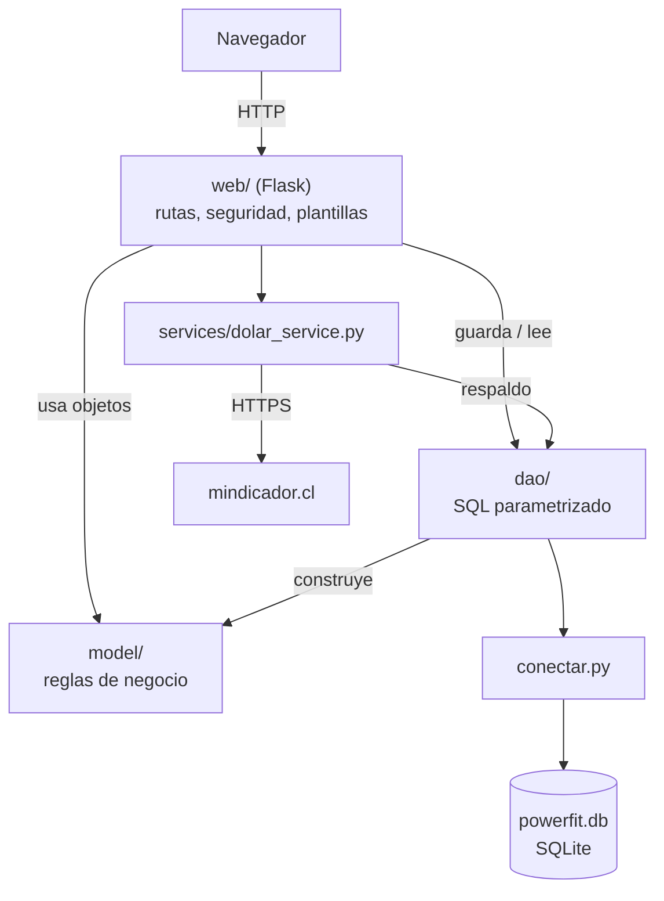
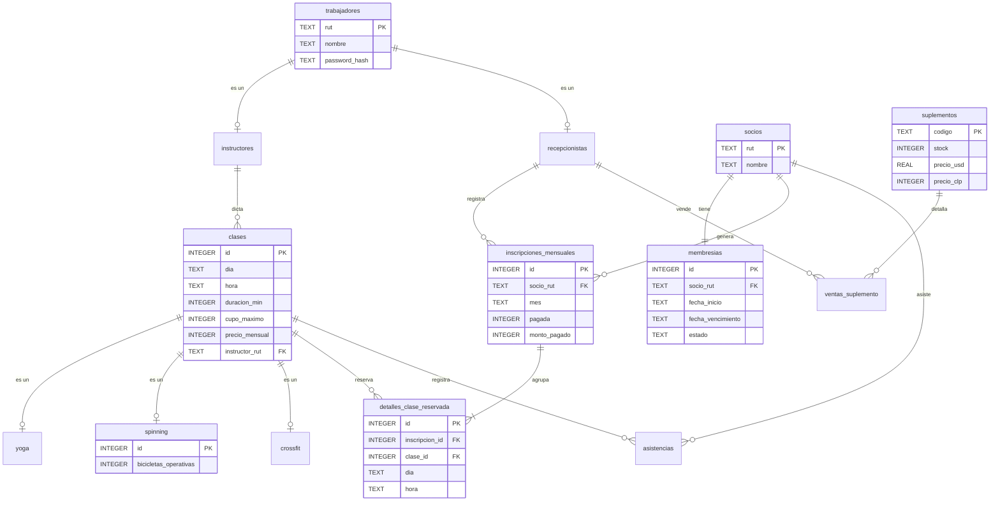

# 🧱 Arquitectura y base de datos

## 1. Capas del sistema

El proyecto separa responsabilidades en capas, igual que el repo del profesor (y le agrega la web):



| Capa | Qué hace | Qué NO hace |
|---|---|---|
| `model/` | Las reglas del negocio: validar RUT, calcular cupos, lanzar excepciones, cobrar | No sabe que existe una base de datos ni una web |
| `dao/` | Traduce objetos ↔ filas de tablas; transacciones | No decide reglas de negocio (solo las protege en la BD) |
| `services/` | Habla con sistemas externos (API del dólar) | No guarda lógica del gimnasio |
| `web/` | Recibe al usuario, revisa permisos y llama a model + dao | No calcula nada del negocio por su cuenta |

**¿Por qué así?** Si mañana la web cambia (por ejemplo, a una app móvil), `model/` y `dao/` siguen sirviendo tal cual. Además, cada capa se puede probar por separado (ver `tests/`).

### Recorrido de una operación: inscribir a un socio

1. La recepcionista marca clases en `/inscripciones/nueva` → `web/inscripciones.py`.
2. `@requiere_rol("recepcionista")` revisa el permiso y `validar_csrf()` revisa el token.
3. Se crea `InscripcionMensual` y se llama `agregar_clase()` por cada clase → si una está llena, el **modelo** lanza `CupoLlenoException`.
4. `InscripcionMensualDao.guardar()` abre `BEGIN IMMEDIATE`, **vuelve a contar los cupos en la BD**, inserta la cabecera y los detalles y hace `commit`. Si algo falla hace `rollback`: no queda nada a medias.

## 2. Base de datos: SQLite

**¿Qué es?** Una base de datos relacional completa guardada en **un solo archivo** (`powerfit.db`). No necesita instalar un servidor: viene incluida en Python (`import sqlite3`).

**¿Por qué SQLite?**
- Es la misma que usa el profesor.
- Cero configuración: ideal para un prototipo y para el hosting gratuito.
- Soporta todo lo que necesitamos: llaves foráneas, transacciones, `UNIQUE`, `CHECK`.

**¿Cómo se vincula?** `conectar.py` → `crear_conexion()` abre el archivo y activa `PRAGMA foreign_keys = ON` (en SQLite vienen apagadas). Cada DAO recibe esa conexión en su constructor (`Dao.__init__`). En la web, cada petición abre su propia conexión (`web/db.py`) y la cierra al terminar.

Para migrar a PostgreSQL/MySQL en el futuro bastaría con cambiar `conectar.py` y ajustar detalles de SQL en los DAOs; `model/` no cambia.

## 3. Modelo de datos (15 tablas)



Tablas de apoyo: `asistencias`, `ventas_suplemento` e `indicadores` (último valor del dólar, usado como respaldo).

### Cómo cada relación del UML quedó en la BD

| Relación UML | Implementación en SQL |
|---|---|
| **Herencia** Trabajador → Instructor/Recepcionista | Tabla por tipo: `instructores.rut` es PK **y** FK a `trabajadores.rut` (como `autos` → `vehiculos` del profe) |
| **Herencia** Clase → Yoga/Spinning/Crossfit | Igual: `yoga.id`, `spinning.id`, `crossfit.id` son PK + FK a `clases.id`. `spinning` guarda además `bicicletas_operativas` |
| **Composición** Socio ◆ Membresia (1 a 1) | `membresias.socio_rut` **UNIQUE** + `ON DELETE CASCADE` |
| **Composición** InscripcionMensual ◆ Detalle (1..*) | `detalles.inscripcion_id` con `ON DELETE CASCADE`; el mínimo de 1 lo valida el código |
| **Asociación** Detalle → Clase | FK sin cascada: no se puede borrar una clase que tiene reservas |
| **Asociación** Instructor dicta Clase | `clases.instructor_rut` FK |
| **Asociación** Socio genera Inscripción | `inscripciones_mensuales.socio_rut` FK + `UNIQUE(socio_rut, mes)` |

### Decisión importante: los "inscritos" se cuentan, no se guardan

El UML tiene `Clase.inscritos`. En vez de guardar un número que se puede desincronizar, `ClaseDao` lo **calcula** contando las reservas de ese mes:

```sql
SELECT COUNT(*) FROM detalles_clase_reservada d
JOIN inscripciones_mensuales i ON i.id = d.inscripcion_id
WHERE d.clase_id = ? AND i.mes = ?
```

Así, anular una inscripción libera el cupo automáticamente y el cupo se reinicia solo cada mes.

## 4. Cambios respecto al diagrama UML original

| Cambio | Motivo |
|---|---|
| `Clase` agrega `precio_mensual` e `instructor_rut` | `calcular_total()` necesita precios, y la asociación "Instructor dicta Clase" necesita saber quién dicta |
| `Clase.horario` se guarda como día + hora | Las clases se repiten cada semana ("Yoga los lunes") |
| `Spinning` agrega `bicicletas_operativas` | Es su regla propia de cupos |
| `Instructor` agrega `crear_clase()` | El requerimiento 2 implica que alguien sí puede crear clases |
| `InscripcionMensual` agrega `pagada` | Evita cobrar dos veces |
| Tabla `asistencias` | `marcar_asistencia()` necesita dónde guardar el registro |
| Los montos se manejan en pesos enteros (`int`) | El peso chileno no usa decimales; evita errores de redondeo con `float` |

Estos cambios se deben reflejar en el `.drawio` actualizado (historia "Informe final y UML actualizado" del backlog).
